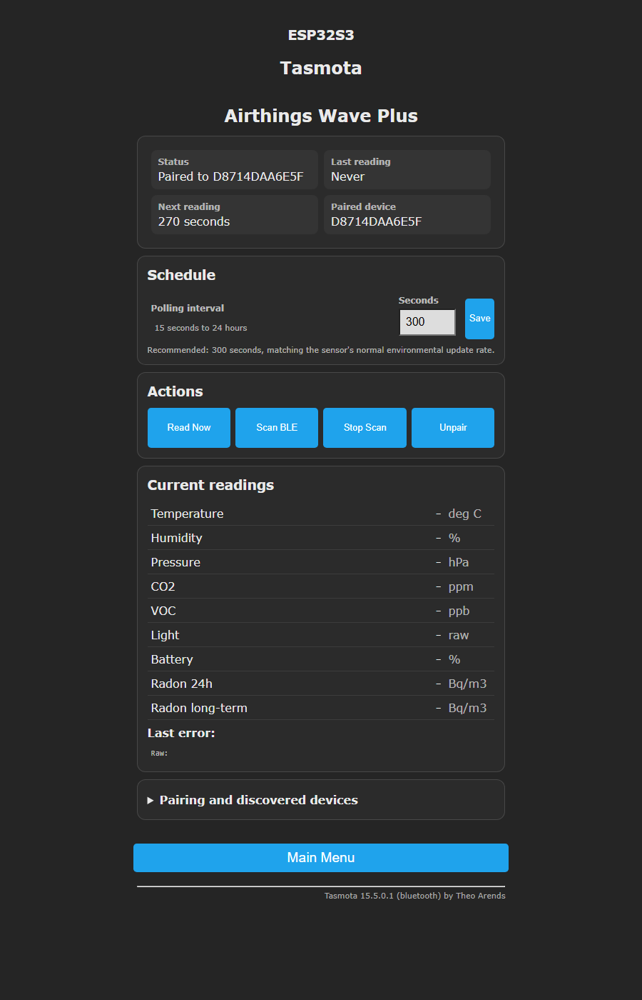

# Airthings Tasmota ESP32-S3 Gateway

An ESP32-S3 gateway for the Airthings Wave Plus 2930, built on Tasmota with Berry, BLE/MI32, MQTT, Home Assistant discovery, and Matter.



## Features

- Reads temperature, humidity, pressure, CO2, TVOC, Radon, ambient light, and battery data over BLE.
- Responsive local dashboard with Read Now, configurable polling, reading age, stale-data detection, and sensor-health scoring.
- Persistent per-device history charts and CSV export.
- Friendly names and independent state/history for up to two Airthings sensors.
- Configurable units, calibration offsets, alert thresholds, hysteresis, and cooldown.
- Per-device MQTT topics and optional Home Assistant MQTT discovery.
- Separate Matter virtual endpoints for two sensors.
- Optional local SmartThings LAN Edge driver that groups every reading from one physical Airthings monitor into one SmartThings device.
- JSON configuration backup, validation preview, restore, and automatic schema migration.
- Rolling diagnostics and automatic BLE retry/backoff.
- Automated Windows patch, build, flash, commission, deploy, and verification workflows.

## Hardware and prerequisites

- ESP32-S3 supported by Tasmota
- Airthings Wave Plus model 2930
- Windows
- Python with `pyserial` and `esptool`
- Git
- Docker Desktop for firmware builds

## Quick start

1. Clone the repository:

   ```powershell
   git clone https://github.com/jzhvymetal/airthings-tasmota-esp32s3-gateway.git
   cd airthings-tasmota-esp32s3-gateway
   ```

2. Create your private settings file:

   ```powershell
   Copy-Item airthings_settings.example.ini airthings_settings.ini
   notepad airthings_settings.ini
   ```

3. Install or verify requirements:

   ```bat
   00_INSTALL_REQUIREMENTS_AND_CODEX.cmd
   ```

4. Validate the configuration:

   ```bat
   airthings_standalone.cmd preflight
   ```

5. Run a fresh installation:

   ```bat
   airthings_standalone.cmd all
   ```

For an existing installation that should retain its settings and filesystem:

```bat
airthings_standalone.cmd all --preserve
```

For a fast Berry driver and web-interface update without rebuilding or flashing firmware:

```bat
airthings_standalone.cmd deploy
```

## Web interface

After commissioning, open:

```text
http://<device-ip>/airthings
```

The device IP, serial port, Wi-Fi credentials, Airthings MAC, build environment, and verification timeout are configured in the ignored `airthings_settings.ini`.

## MQTT

Each successful read is published to:

```text
tele/airthings2930/<MAC>/SENSOR
```

The compatibility topic below contains the most recently read device:

```text
tele/airthings2930/SENSOR
```

Alerts and clear events are published to:

```text
tele/airthings2930/ALERT
```

## Security and repository safety

Never commit `airthings_settings.ini`; it contains local Wi-Fi and device information. The supplied `.gitignore` excludes that file along with firmware builds, logs, downloaded Tasmota sources, caches, and runtime exports.

Use `airthings_settings.example.ini` as the public template. The GitHub publishing helper performs an additional check and stops if the private settings file becomes staged:

```bat
github_publish.cmd
```

## Documentation

- [Complete setup, operation, Matter mapping, recovery, and version history](airthings2930_README.md)
- [Prebuilt firmware commissioning guide](RELEASE_COMMISSIONING.md)
- [Package overview](README_ROOTDIR.md)
- [Publishable settings template](airthings_settings.example.ini)
- [Release checksums](SHA256SUMS.csv)

## Current version

Workflow version: **2.3.0**

The Berry runtime driver reports its own version through the local API and MQTT payload.

## SmartThings Edge option

The `smartthings-edge` directory contains a local LAN driver that bypasses
Matter's device-profile limitations. It uses SmartThings' standard temperature,
humidity, pressure, CO2, TVOC, illuminance, battery, and Radon capabilities.
Run `smartthings_edge_install.cmd`, sign in through the SmartThings CLI, select
the intended driver channel and hub, then scan for nearby devices in the app.
Configure the ESP32's local IPv4 address on the gateway device. See
[`smartthings-edge/README.md`](smartthings-edge/README.md) for details.

## License

No license has been selected yet. Until a license is added, normal copyright restrictions apply.
